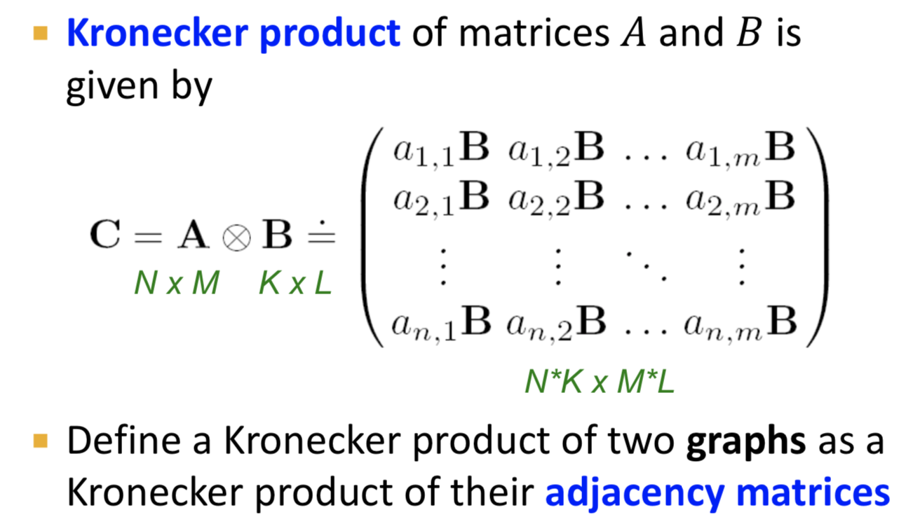

[TOC]

# 第二章 network的性质，random graph models

## 2.1 network properties

### (1) degreee distribution

度的分布$$p(k)=\frac{N_k}{N}$$

### (2) paths

  图中的路径$$p_n=\{i_0,i_1,i_2,\ldots,i_n \}$$

### (3) distance

两个节点间的最短路径，有向图中路径不是对称的（根据方向而变）

### (4) 直径

图中两个节点的最大的最短路径

### (5) clustering coefficient(无向图)

主要衡量节点i的邻居之间的紧密程度。
$$
C_i=\frac{2e_i}{k_i(k_i-1)}
$$
其中$e_i$表示节点i的邻居之间，有多少条边

### (6) Connectivity

最大联通子图的size

## 2.2 Erdos-Renyi random graph model

### degree distribution

$G_{np}$: n个节点，边$(u,v)$以概率p独立同分布的无向图
$$
P(k)=C_{n-1}^k p^k(1-p)^{n-1-k}
$$

### clustering coeff

### Path length

 

## The small-world model

我们可以同时使得clustering很大，diameter很小吗（最小直径为$log(n)$）

## kronecker graph model

不断地进行kronecker乘积

## 第三章 link analysis

Directed Graph的两种类型:

+ 强连通子图
+ Directed Acyclic Graph (DAG): 有向无环图

###  强连通子图 (Strongly connected Component)：

+ 图中每一个nodes可以有向的连接

+ 任意nodes的出节点，入节点都一样，即   $in(A)=out(A)={A,B,C,D,E}$

+ 每个节点都是SCC
+ 如果$G^{'}$由scc组成，且scc之间有边，那么$G^{'}$是一个DAG有向无环图。

+ 计算包含节点A的SCC: $$SCC(A)= in(A) \cap out(A)$$

### Pagerank

>  每个页面的重要性一样吗？图中其实已经endoe了node的重要性。

如果i的importance为$r_i$，i有$d_i$条出来的边，那么从i出来的每条边获得的votes是$\frac{r_i}{d_i}$

而j的importance是所有入边的sum
$$
r_j=\sum_{i\rightarrow j}\frac{r_i}{d_i}
$$
邻接矩阵M:

定义邻接矩阵M:
$$
对于任意node \ j，出度为d_j;\\
假如j \rightarrow i, 那么r_i=\sum_{j \rightarrow i}\frac{r_j}{d_j}\\则此处定义M_{ij}=\frac{1}{d_j}\\
r=M\cdot r
$$
从随机游走的角度来说，本身页面满足一个分布$p(t)$

$$P(t+1) = M\cdot p(t)\\P(t+1) = M\cdot p(t)=p(t)则服从一个平稳分布$$

则$r$是随机游走的一个平稳分布。

+ 如何求解这个问题:

迭代，直到前后两次的分布的差别小于某个阈值。

#### 存在的问题:

+ dead ends: 有些节点没有出度，这可能会导致信息丢失

  解决方式: 

  

+  spider traps：陷阱点，有环的存在，导致一直在一个圈里绕。

​        解决方式: 设置概率$1-\beta$跳到随机一个页面，$\beta$继续传播

#### 算法流程:

其中$\frac{1-s}{N}$当没有dead ends时，1-1=0.否则1-0=1

### personalized pagerank

不仅仅依靠popularity，同时考虑与目标搜索词的相似性。
$$
M_{ij}^{'}=\beta M_{ij} + (1-\beta)/|S|=\beta M_{ij}
$$
Teleporting 就是跳出dead end的这个行为。S表示teleport set

个性化的PageRank就是，以$(1-\beta)$的概率跳转到我们的`teleport set`,而不是之前的随机节点。

因此假设只有一个兴趣点，那么每次游走都有一定概率重新启动。

### SimRank

两个实体如果和同一个实体相似，他们二者相似。

两个node的相似性，是所有邻居与其相似性的均值。
$$
s(a,b)=\frac{C}{|I(a)||I(n)|}\sum_{i=1}^{|I(a)|}\sum_{j=1}^{|I(b)|}s(I_i(a)，I_j(b))
$$

## 第四章 Network Construction,Inference and Deconvolution

> 如何将一些非网络数据，转为Graph问题

### 4.1 Multimode network transformations

Multi-partite networks：节点有不同类型，而且边都是不同类型的节点之间形成的。

One-mode projections

#### cliques（团）

Cliques(团):无向图中，俩俩之间有边连接的节点的集合。

#### Graph contraction

Graph contraction:收缩graph。在每一个小图上进行计算，并行地操作。

流程:

1. 对Graph做一个节点的划分；
2. 每一个partition用一个supernode代替
3. supernode之间只保留一个边
4. 产生一个新的小图$G^{'}$

+ 如何对Graph的节点做一个划分?
  + 1. 每一个划分是一个最大团
    2. 每一个划分里，要么是单个节点，要么是两个相连的节点
    3. 每一个划分是一个star of nodes

### 4.2 Efficient Construction of K-NNG

#### K-NNG的定义

k-nearest neighbor graph：一个节点和它的最近的k个节点之间有edge，对于距离的衡量，比如:

+ 文本中，词的距离可以用余弦相似度
+ 图像中，可以用图像转化为矩阵后，l2距离来衡量

应用：

+ 推荐系统：给相似的用户推荐商品
+ document retrieval system
+ Vlustering,visualization,manifold learning
+ 可以用K-NNG来去做可视化，相当于将原先的多维空间转化为2维

#### K-NNG： A Brute-force Approach

穷举？ 计算过程就是先计算$V \times V$ 的距离矩阵，之后计算$V$的最近的$K$个节点,整个过程的复杂度是$O(n^2)$

我们只需要计算K个最近的，并不需要计算所有V个距离。

#### NN-DescentAppproach

NN-Descent算法[Dong 2011]：approximate K-NNG construction with arbitraray similarity measure.

原理：邻居的邻居，很可能是邻居。

流程：

+ 根据(growing constant C)选择一个足够大的K
+ 初始化一个K-NNG的approximation
+ 对每一个v，计算K个近邻居的邻居，如果有邻居的邻居，则纳入过来
+ 重复如上过程，知道没有任何improvement可以做

其他算法:

+ locality sensitive hashing (LSH)
+ recurisive lanczos bisection
+ K-NN search problem

### 4.3 Network Deconvolution and Inference

> Motivation: 如何将direct correlation和indirect correlation分隔开来。

如上图所示，`Network Deconvolution`实质上就是把indirect effects剥离，仅仅保留direct effects

假设长度为2的indirect correlation，长度为3……，这是一个线性增长，而不是一个爆炸式增长的情况，那么$G_{dir}$的最大特征值小于1，可以用如下公式计算。

应用:

+ 发现author间的强联系或者弱联系

其他方法:

+ paritial correlations and random matrix therory
+ Graphical models:Graphical Lasso,Bayesian nets,Markov random fields
+ Casual inference models

## 第五章 Motifs and Graphlets

之前定义的Network的metrics指标主要有:

+ Node level: 出入度，PageRank值，node clustering
+ Whole-network level: 直径

相较于衡量整个graph，或者某一个节点，我们能不能找到一些统计量来衡量中等大小结构。

### motifs

> Motifs（网络主题）:recucrring,significant,patterns of interconnections

+ pattern : induced/non-induced subgraph.

  induced Graph指的是导出子图：一个节点子集S，并包含两个节点都属于S的边的集合。

+ recurring: 出现很多次

+ significant： more frequent than expected。更容易出现在现实中，不太容易出现在random Network中，我们认为它更有意义。

#### significance of motif

motifs are overpresented in a network when compared to randomized networks.

 

### Graphlets

非同构的subgraph

#### graphlet degree vector

计算每一个node touch的graphlet的个数。对于每一个node，都会有一个GDV，这个向量上的每一个值，对应了某一个Graphlet与此node的出现评率。

+ 这样，利用GDV，衡量了哪些节点是某一种拓扑结构的常客。

+ 当比较两个GDV时，当向量相似时，那么这两个节点附近的local 拓扑结构也相似，也不失为一种衡量相似性的方法。

### Graph Isomorphism

图同构:G 和 H是同构的，当且仅当存在一个映射$f:V(G)\rightarrow V(H)$

对于G中任意相邻节点$u$和$v$,$f(u)$和$f(v)$在H中也是相邻节点。